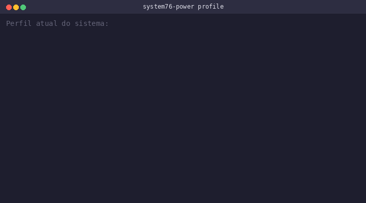

# pop-os-power-switch

Troca automaticamente o perfil de energia do Pop!_OS entre **performance** e **balanced** dependendo se o notebook está na tomada ou na bateria.



O Pop!_OS usa o `system76-power` pra gerenciar os perfis de energia. O problema é que ele não troca o perfil automaticamente quando você conecta ou desconecta o cabo de energia — você fica preso no último perfil que escolheu manualmente. Esse script resolve isso.

Pra quem usa notebook no dia a dia: na tomada você quer performance total, na bateria você quer economizar. Simples assim.

E o brilho da tela também não é mais alterado pela troca de perfil — o script salva e restaura o valor atual, então se você ajustou o brilho pra 50%, ele fica em 50% independente do perfil.

## Como funciona

- **AC conectada** → perfil `performance`
- **Na bateria** → perfil `balanced`
- O brilho da tela é preservado durante a troca
- Reage em tempo real a conectar/desconectar o cabo de energia (via regra udev)
- No boot, já aplica o perfil correto (via serviço systemd)

## Instalação

Clone o repositório e rode o instalador:

```bash
git clone https://github.com/lucascosm3/pop-os-power-switch.git
cd pop-os-power-switch
sudo ./install.sh
```

Pronto, tá funcionando. Conecta e desconecta o cabo pra testar.

## Desinstalação

```bash
sudo ./uninstall.sh
```

Volta pro comportamento padrão do Pop!_OS.

## O que é instalado

| Arquivo | Local |
|---|---|
| Script principal | `/usr/local/bin/power-profile-switch.sh` |
| Regra udev | `/etc/udev/rules.d/99-power-profile.rules` |
| Serviço systemd | `/etc/systemd/system/power-profile-switch.service` |

## Verificando

Depois de instalar, você pode checar se tá tudo certo:

```bash
# Ver o perfil atual
system76-power profile

# Status do serviço
systemctl status power-profile-switch.service
```

## Compatibilidade

- Pop!_OS 22.04+
- Requer `system76-power` (já vem instalado no Pop!_OS)
- Funciona em notebooks com `intel_backlight` ou `amdgpu_bl`

## Licença

MIT — usa como quiser.